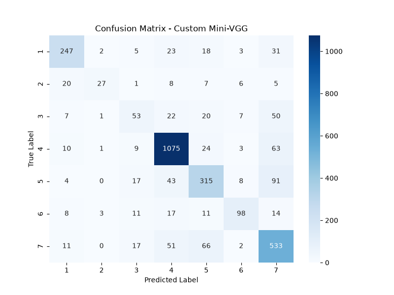
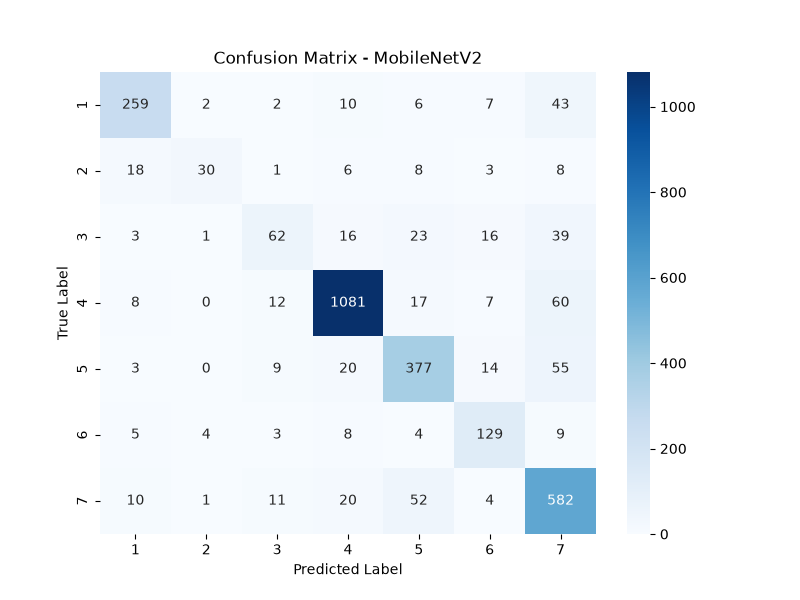
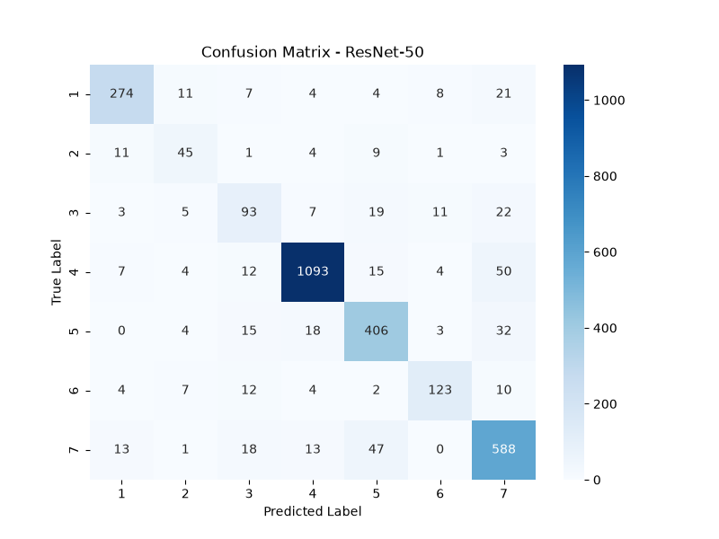

# Emotion Recognition Project
This is my personal project for facial emotion recognition. I built this to learn about Deep Learning, PyTorch, and how to deploy a model using FastAPI and OpenCV. 
It predicts 7 basic emotions: Happy, Sad, Angry, Surprise, Fear, Disgust, and Neutral.

## How to setup and run
### 1. Create virtual environment
First, you need to create a python virtual environment so it doesn't mess up your global python:

```bash
# For Windows
python -m venv env
.\env\Scripts\activate

# For Mac/Linux
python3 -m venv env
source env/bin/activate
```

### 2. Install packages
Install all the required libraries:
```bash
pip install -r requirements.txt
pip install scikit-learn matplotlib seaborn pandas tabulate
```

### 3. Download weights
Because the model weights are too large for GitHub, please download them from my Google Drive link here:
[Download Models Here](https://drive.google.com/drive/folders/1APRgIuQ5Tef1lhNMSDRfehjbNzNxwlcS?usp=sharing)

Put the 3 `.pth` files inside the `models/` folder.

### 4. Run the code
Move into the `src` folder first:
```bash
cd src
```

**To test with Webcam:**
```bash
python inference.py
```
Press 'q' to stop the webcam.

**To run the Web App (Website):**
```bash
python app.py
```
Then open your browser and go to `http://localhost:8000` to upload an image and test it.

---
## What I Learned
Through this project, I learned a lot of new things:
- How to build a Convolutional Neural Network (CNN) from scratch.
- How to use Transfer Learning with MobileNetV2 and ResNet-50.
- How to use OpenCV to detect faces in an image/webcam using Haar Cascades.
- How to build a simple backend API using FastAPI to serve my deep learning model.
- How to handle data transformations and write training loops in PyTorch.
## Model Evaluation & Comparison

We evaluated and compared the three models across multiple metrics (Accuracy, Precision, Recall, F1-Score) and summarized their performance, pros, and cons below:

| Model | Accuracy | Precision | Recall | F1-Score | Pros | Cons |
| :--- | :---: | :---: | :---: | :---: | :--- | :--- |
| **Custom Mini-VGG** | 76.53% | 72.39% | 62.88% | 66.11% | Easy to code, small, fast to train. Good for learning the basics. | Lowest accuracy, struggles with hard emotions like Disgust or Fear. |
| **MobileNetV2** | 82.14% | 77.27% | 70.48% | 72.49% | Very lightweight and fast. **Best choice for real-time webcam** inference (no lag). | Not as accurate as heavier models. |
| **ResNet-50** | **85.46%** | **77.80%** | **77.40%** | **77.55%** | **Highest accuracy**, excellent at extracting complex features. | Heavy and slow, demands high computational resources. |

### Confusion Matrices

To analyze where each model struggles, we plotted confusion matrices:

| Custom Mini-VGG | MobileNetV2 | ResNet-50 |
| :---: | :---: | :---: |
|  |  |  |

---

## Web App Test Run Examples

Below are prediction examples from the web application interface:

| Happy | Surprise |
| :---: | :---: |
|  |  |
| **Sad** | **Angry** |
|  |  |

If I have more time, I want to improve this project by:
- Using a better face detector like MTCNN or RetinaFace instead of OpenCV Haar Cascade, because Haar Cascade sometimes misses faces if the lighting is bad.
- Trying out Vision Transformers (ViT) to see if it gets better accuracy.
- Collecting more data for "Disgust" and "Fear" because the dataset is imbalanced.
- Deploying the web app to a real server so anyone can try it online.
